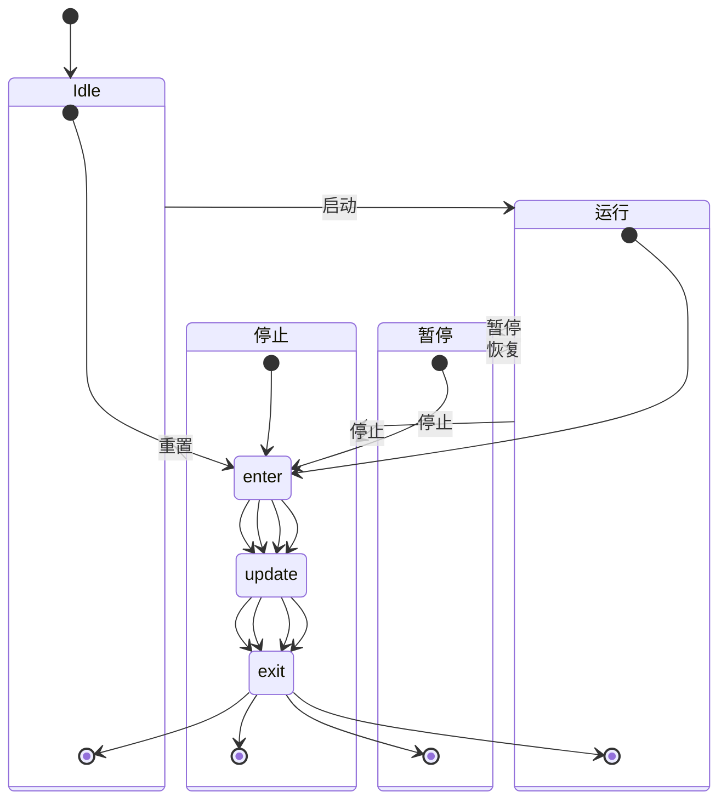

```mermaid
stateDiagram
    [*] --> Idle
    state Idle {
        [*] --> enter
        enter --> update
        update --> exit
        exit --> [*]
    }
    Idle --> 运行 : 启动
    state 运行 {
        [*] --> enter
        enter --> update
        update --> exit
        exit --> [*]
    }
    运行 --> 暂停 : 暂停
    运行 --> 停止 : 停止
    state 暂停 {
        [*] --> enter
        enter --> update
        update --> exit
        exit --> [*]
    }
    暂停 --> 运行 : 恢复
    暂停 --> 停止 : 停止
    state 停止 {
        [*] --> enter
        enter --> update
        update --> exit
        exit --> [*]
    }
    停止 --> Idle : 重置

```