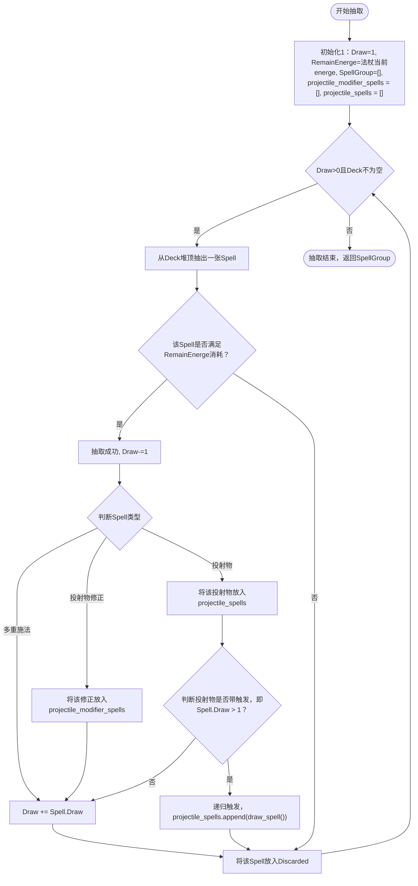

```mermaid
flowchart TD
    Start(["开始抽取"]) --> 初始化1["初始化1：Draw=1, RemainEnerge=法杖当前energe, SpellGroup=[], projectile_modifier_spells = [], projectile_spells = []"]
    初始化1 --> 循环判断{"Draw>0且Deck不为空"}
    循环判断 --> |是| Deck抽牌["从Deck堆顶抽出一张Spell"]
    循环判断 --> |否| End(["抽取结束，返回SpellGroup"])
    Deck抽牌 --> energe判断{"该Spell是否满足RemainEnerge消耗？"}
    energe判断 --> |是| 抽取成功["抽取成功, Draw-=1"]
    energe判断 --> |否| Spell入Discared["将该Spell放入Discarded"] --> 循环判断
    抽取成功 --> 判断Spell类型{"判断Spell类型"}
    判断Spell类型 --> |多重施法| 计算Draw["Draw += Spell.Draw"]
    判断Spell类型 --> |投射物修正| 记录投射修正["将该修正放入projectile_modifier_spells"]
    判断Spell类型 --> |投射物| 记录投射物["将该投射物放入projectile_spells"]
    记录投射物 --> 判断投射物是否带触发{"判断投射物是否带触发，即Spell.Draw > 1？"}
    判断投射物是否带触发 --> |否| 计算Draw
    判断投射物是否带触发 --> |是| 递归触发["递归触发，projectile_spells.append(draw_spell())"]
    递归触发 --> Spell入Discared
    记录投射修正 --> 计算Draw
    计算Draw --> Spell入Discared
```