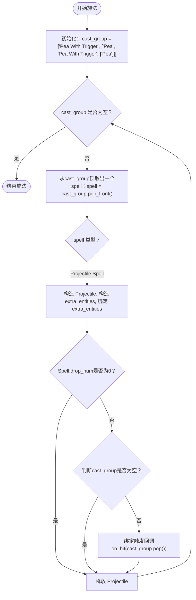

开始测试：
- 输入：[火花弹]

```mermaid
flowchart TD
    Start(["开始施法"]) --> 初始化1["初始化1: cast_group = ['Pea With Trigger', ['Pea', 'Pea With Trigger', ['Pea']]]"]
    初始化1 --> 施法循环{cast_group 是否为空？}
    施法循环 --> |是| End(["结束施法"])
    施法循环 --> |否| 提取value["从cast_group顶取出一个spell：spell = cast_group.pop_front()"]
    提取value --> value类型判断{spell 类型？}
    value类型判断 --> |Projectile Spell| 构造Projectile["构造 Projectile, 构造 extra_entities, 绑定 extra_entities"]
    构造Projectile --> 释放数判断{"Spell.drop_num是否为0？"}
    释放数判断 --> |是| 释放Projectile["释放 Projectile"]
    释放数判断 --> |否| 判断剩余group{"判断cast_group是否为空？"}
    判断剩余group --> |是| 释放Projectile
    判断剩余group --> |否| 绑定触发回调["绑定触发回调on_hit(cast_group.pop())"]
    绑定触发回调 --> 释放Projectile
    释放Projectile --> 施法循环
```

---
