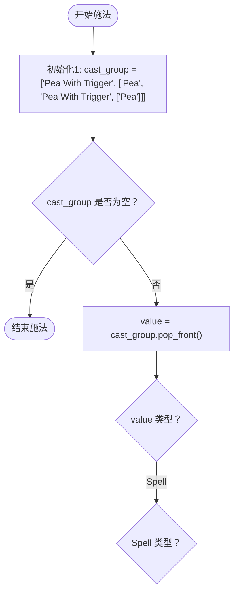

开始测试：
- 输入：[火花弹]

```mermaid
flowchart TD
    Start(["开始施法"]) --> 初始化1["初始化1: cast_group = ['Pea With Trigger', ['Pea', 'Pea With Trigger', ['Pea']]]"]
    初始化1 --> 施法循环{cast_group 是否为空？}
    施法循环 --> |是| End(["结束施法"])
    施法循环 --> |否| 提取value["value = cast_group.pop_front()"]
    提取value --> value类型判断{value 类型？}
    value类型判断 --> |Spell| Spell类型判断{"Spell 类型？"}
```

---
